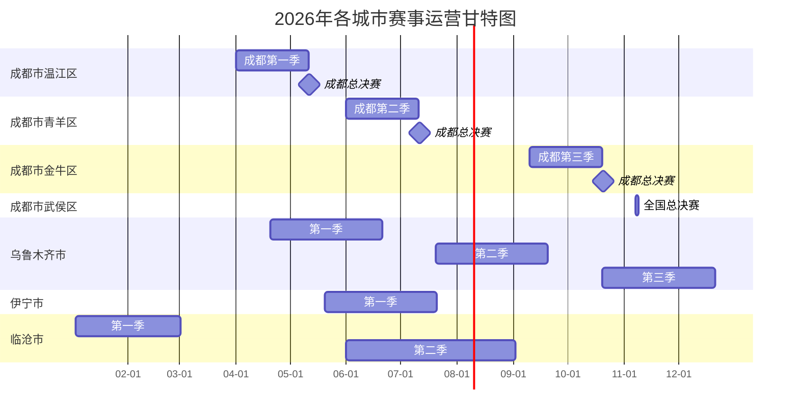

```mermaid
gantt
    title 2026年各城市赛事运营甘特图
    dateFormat YYYY-MM-DD
    axisFormat %m-%d
    
    section 成都市温江区
    成都第一季 :wj, 2026-04-01, 40d
    成都总决赛 :milestone, after wj, 1d

    section 成都市青羊区
    成都第二季 :qy, 2026-06-01, 40d
    成都总决赛 :milestone, after qy, 1d

    section 成都市金牛区
    成都第三季 :jn, 2026-09-10, 40d
    成都总决赛 :milestone, after jn, 1d

    section 成都市武侯区
    全国总决赛 :wh, 2026-11-07, 2d

    section 乌鲁木齐市
    第一季 :wlmq1, 2026-04-20, 62d
    第二季 :wlmq2, 2026-07-20, 62d
    第三季 :wlmq3, 2026-10-20, 62d

    section 伊宁市
    第一季 :yn, 2026-05-20, 62d

    section 临沧市
    第一季 :lc1, 2026-01-03, 58d
    第二季 :lc2, 2026-06-01, 93d
```
